<p align="center">
  
</p>

<h1 align="center">OneTUI</h1>

<p align="center">One TUI for them all.</p>

<p align="center">
  <a href="https://github.com/syndbg/onetui/actions/workflows/main.yaml"></a>
  <a href="LICENSE"></a>
  <a href="rust-toolchain.toml"></a>
</p>

<p align="center">
  <a href="#quick-start">Quick start</a> ·
  <a href="#demo">Demo</a> ·
  <a href="#features-and-datasource-support">Datasources</a> ·
  <a href="#themes">Themes</a> ·
  <a href="#configuration">Configuration</a> ·
  <a href="docs/ui.md">User guide</a> ·
  <a href="CONTRIBUTING.md">Contributing</a>
</p>

OneTUI is a keyboard-driven terminal browser for databases and message streams, with navigation inspired by k9s. Inspect data, run native queries and follow live messages without switching tools.

OneTUI is mostly focused read-only in its initial version. Write support requires a few more features that will be work-in-progress soon.

## Demo

### Data and queries

Browse rows:

[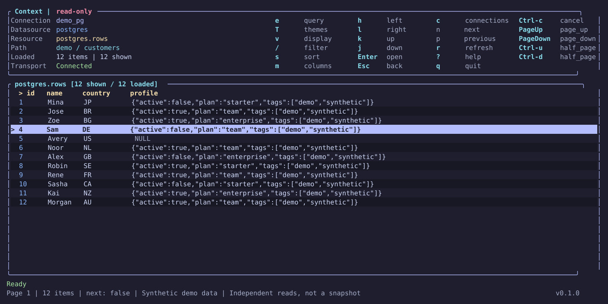](docs/assets/demo/browse.svg)

Inspect a row:

[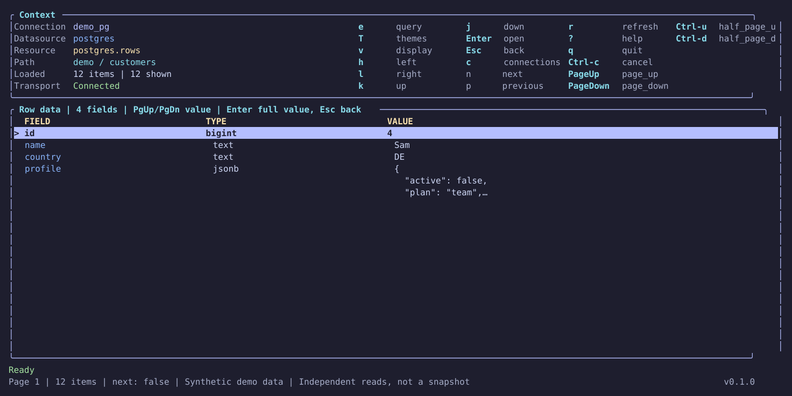](docs/assets/demo/inspect.svg)

Run a native query:

[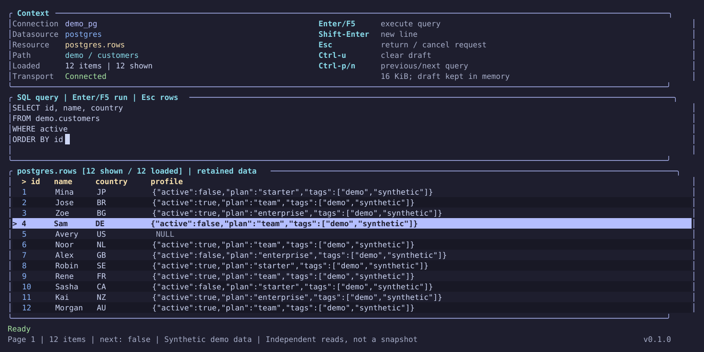](docs/assets/demo/query.svg)

Browse typed DynamoDB items:

[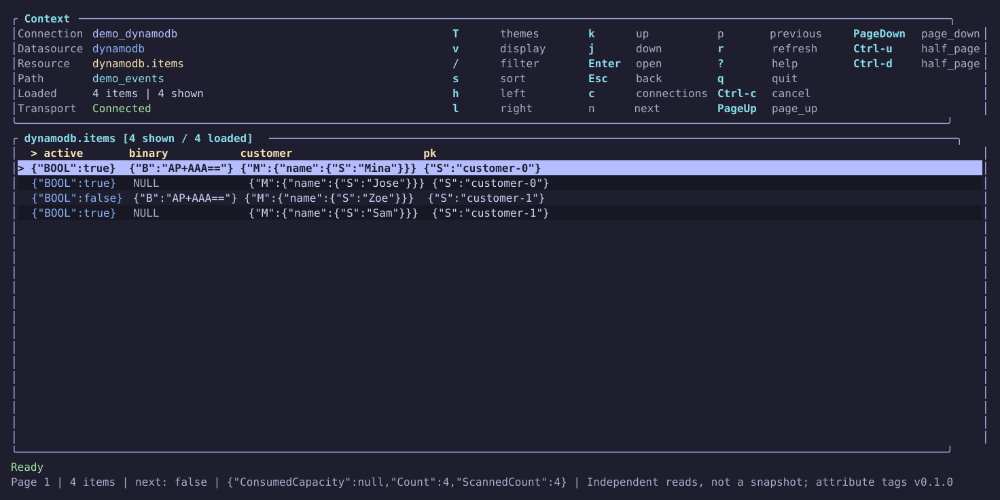](docs/assets/demo/dynamodb-items.svg)

Each Kafka demo binds schemas to both the key and value. The screens below show the decoded key and its schema identity.

Inspect an Avro-decoded key beside its original bytes and schema:

[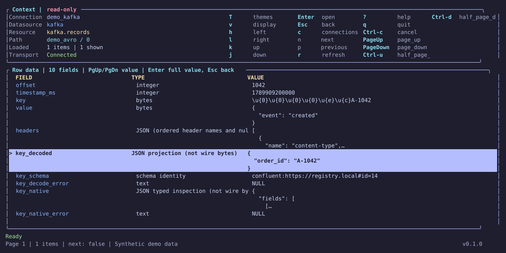](docs/assets/demo/avro.svg)

Inspect a Protobuf-decoded key beside its original bytes and schema:

[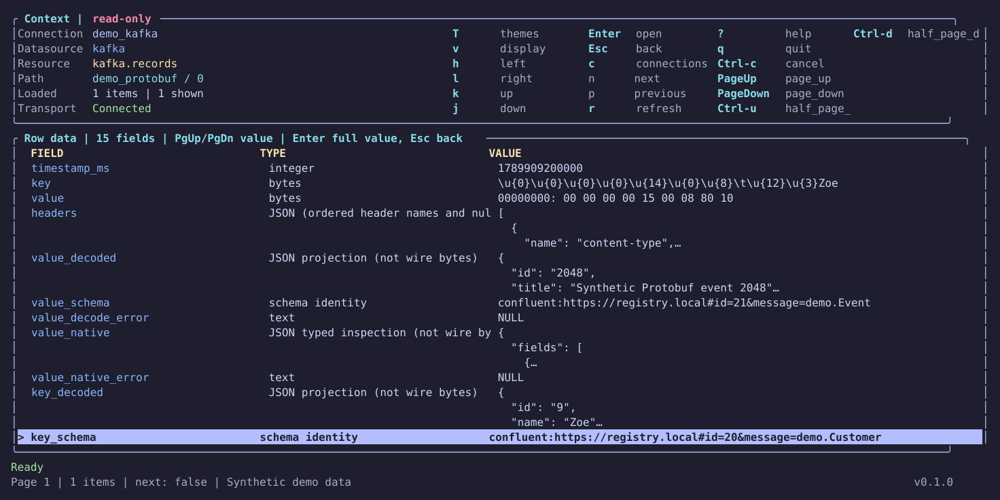](docs/assets/demo/protobuf.svg)

### Operational views

Inspect connected PostgreSQL WAL senders:

[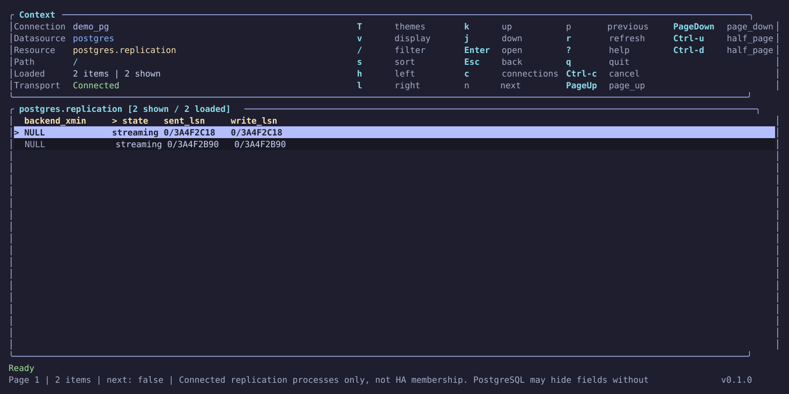](docs/assets/demo/postgres-replication.svg)

Inspect the upstream PostgreSQL WAL receiver:

[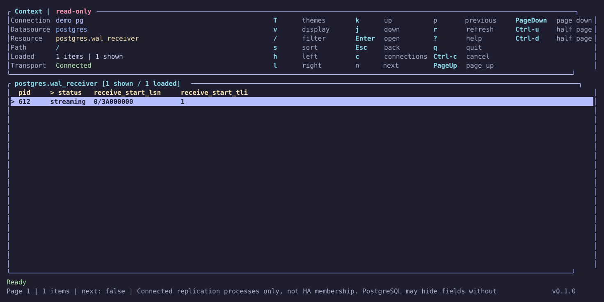](docs/assets/demo/postgres-wal-receiver.svg)

Inspect Kafka consumer groups:

[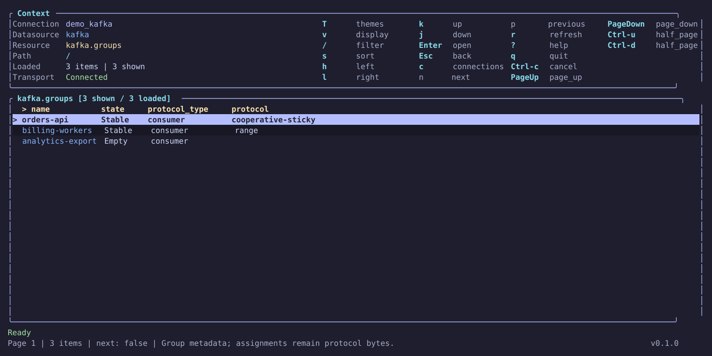](docs/assets/demo/kafka-groups.svg)

Inspect read-only Kafka broker configuration, with sensitive values withheld:

[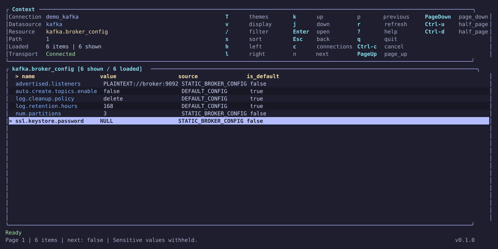](docs/assets/demo/kafka-broker-config.svg)

Inspect Qdrant consensus state:

[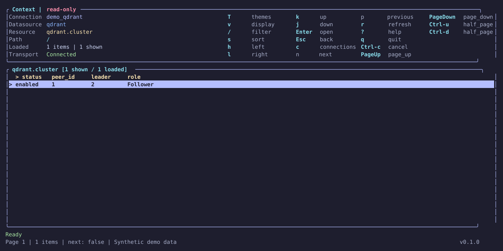](docs/assets/demo/qdrant-consensus.svg)

Inspect DynamoDB stream shards:

[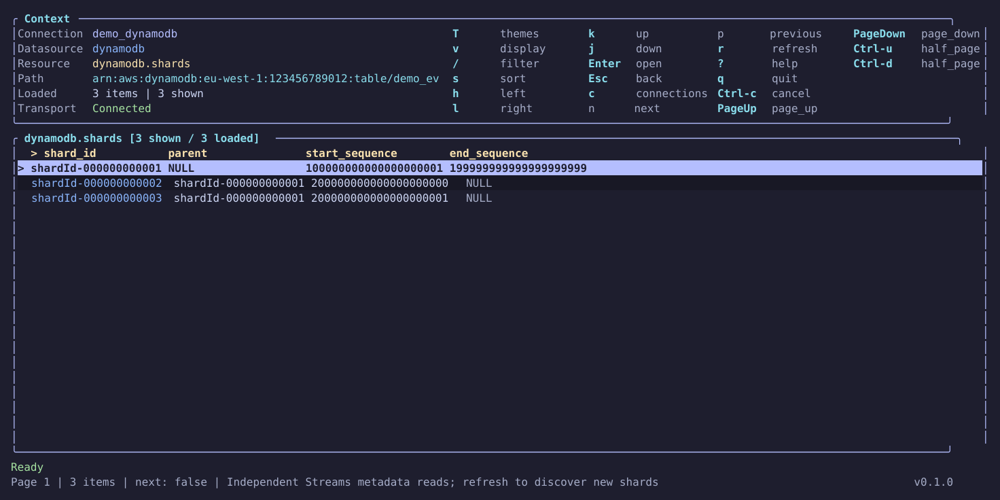](docs/assets/demo/dynamodb-stream-shards.svg)

Inspect RabbitMQ queue metrics:

[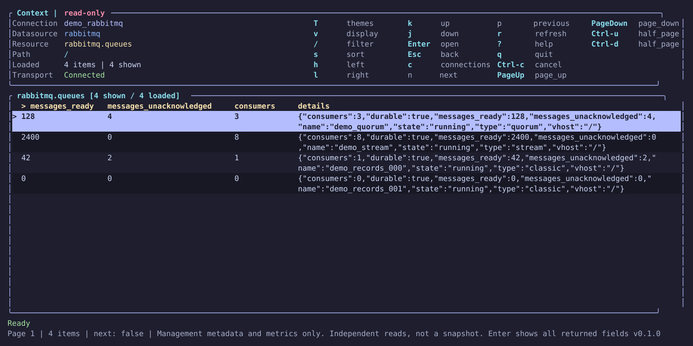](docs/assets/demo/rabbitmq-queues.svg)

Try the disposable demos from a source checkout:

```sh
make dev-up
make dev-run
make dev-traffic # optional live Kafka, Redpanda and NATS messages
```

See [local demos](hack/README.md) for what to open. `make dev-down` deletes the fixture data.

## Install

### GitHub Releases

Download an archive or Linux package from [Releases](https://github.com/syndbg/onetui/releases).

Install a package with `sudo apt install ./onetui-*.deb` or `sudo dnf install ./onetui-*.rpm`.

### Homebrew

```sh
# For the latest from origin/main
brew install --HEAD syndbg/tap/onetui
```

### From source

Install the [build prerequisites](CONTRIBUTING.md#local-setup), then:

```sh
git clone https://github.com/syndbg/onetui.git
cd onetui
cargo install --path . --locked
```

Add Cargo's binary directory, normally `$HOME/.cargo/bin`, to `PATH`.

## Quick start

Run `onetui`. Press `a` to add a connection, fill in its fields and press F2 to save. Select it and press Enter. Set any referenced secret environment variables before launching.

Enter opens a resource or value; Esc goes back. Press `?` for available actions, `/` to filter rows, `e` for a native query or `f` to follow where supported. See the [user guide](docs/ui.md).

## Features and datasource support

| Datasource | Functionality |
| --- | --- |
| [PostgreSQL](docs/postgres.md) | Tables, views, typed values, SQL and replication statistics |
| [Qdrant](docs/qdrant.md) | Collections, points, payloads, vectors, filtered Scroll and topology |
| [Kafka](docs/kafka.md) | Metadata, configuration, groups, lag, record browsing, replay and following |
| [NATS](docs/nats.md) | Core subscriptions, JetStream messages, replay, consumers, KV and objects |
| [DynamoDB](docs/dynamodb.md) | Metadata, typed items, native reads, PartiQL, vector search and Streams |
| [RabbitMQ](docs/rabbitmq.md) | Management metadata and metrics, without message inspection |

Kafka and NATS can decode Avro and Protobuf using files, directory catalogs, Confluent registries or Buf.

Use read-only credentials. Reads still consume server resources. Connector guides explain their distinctive limits.

## Themes

Press `T` to preview ten built-in themes. Set `theme` in your config to keep a preference between runs. See the [theme gallery](docs/themes.md).

## Configuration

### File location

OneTUI reads one file: explicit `--config <path>`, otherwise `$XDG_CONFIG_HOME/onetui/config.toml`, or `$HOME/.config/onetui/config.toml` when XDG_CONFIG_HOME is unset or invalid. Environment paths must be absolute. Files are not merged.

A missing default file opens an empty picker. The connection form creates it when you save. An explicit `--config` file must already exist. The footer shows the selected path.

Fields ending in `_env` name environment variables, not secret values. Use TOML for nested OAuth or decoder settings. For example:

```toml
theme = "monokai"

[connections.local_pg]
kind = "postgres"
url_env = "ONETUI_POSTGRES_URL"
```

### Settings and checks

Use the installed CLI for current settings, examples and capabilities:

```sh
onetui --help
onetui schema
onetui schema --datasource kafka
onetui --check --connection local_pg
```

`schema` works offline. `--check` requires configuration and verifies the selected connection, not every resource permission. Use `--config <path>` to select another file or `--timeout <seconds>` to change the request timeout.

See connector guides for authentication and TLS. Use plaintext only for local development.

### Display settings

Theme and value-display changes in the TUI last for the session. Set persistent defaults through `theme` and `[display]` in TOML. Use `onetui schema` for fields and defaults, or the [display guide](docs/ui.md#value-display-controls) for interactive controls.

## Documentation

- [Navigation and value inspection](docs/ui.md)
- [Native queries](docs/queries.md)
- [Theme gallery](docs/themes.md)
- [Local demos](hack/README.md)

Connector guides are linked in the datasource table above. For implementation decisions, see the [ADRs](docs/adr/).

## Contributing

See [CONTRIBUTING.md](CONTRIBUTING.md) for development and releases. `make help` lists development tasks.

For bugs, include `onetui --version`, the datasource, reproduction steps and sanitized diagnostics in a [GitHub issue](https://github.com/syndbg/onetui/issues). Configured secrets are redacted, but errors can contain server-returned data. Review them before sharing.

## License

OneTUI is licensed under [Apache-2.0](LICENSE). Redistributed binaries must retain the [third-party notices](THIRD_PARTY_NOTICES.md).
