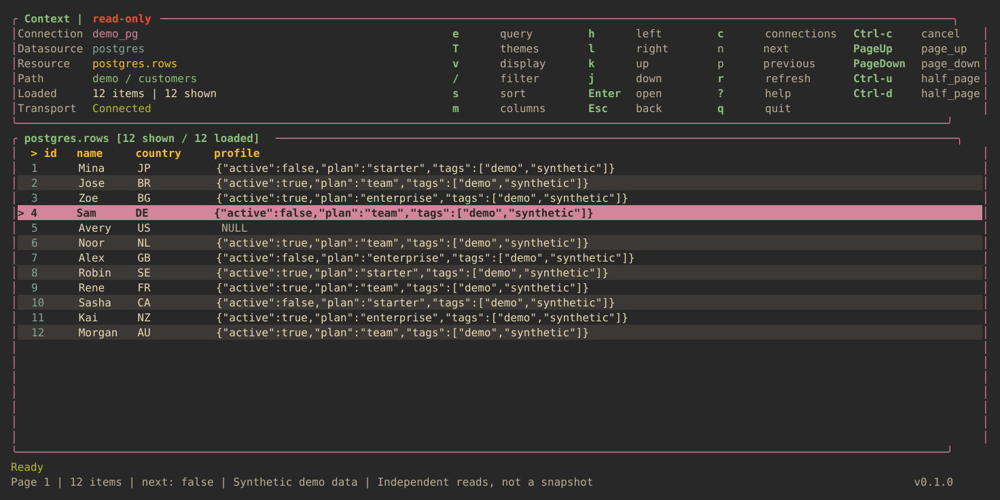
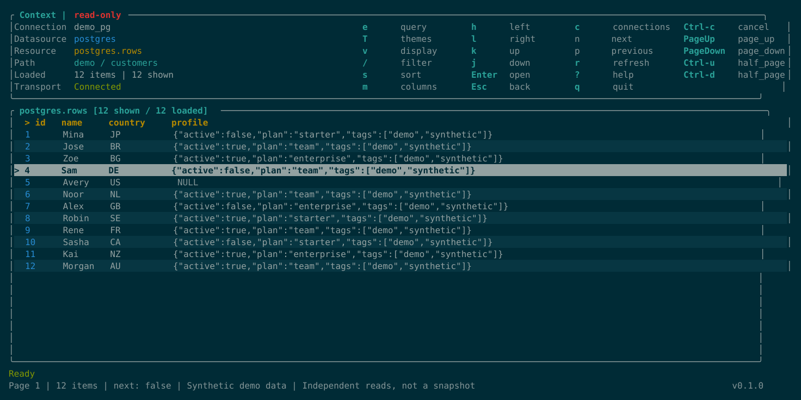
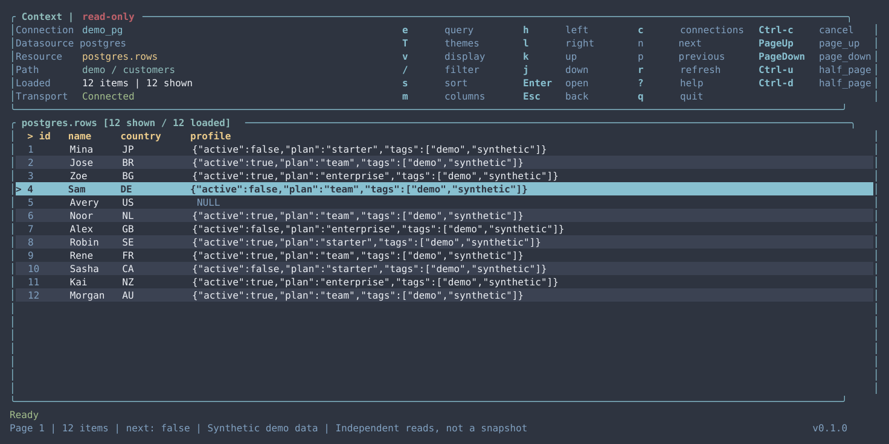
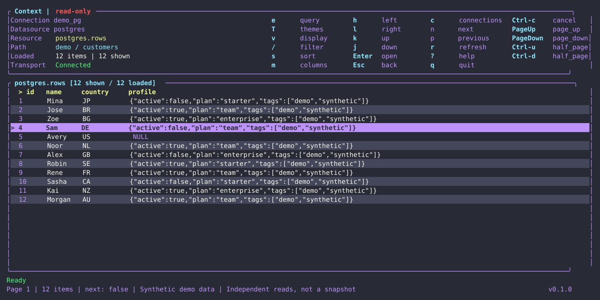
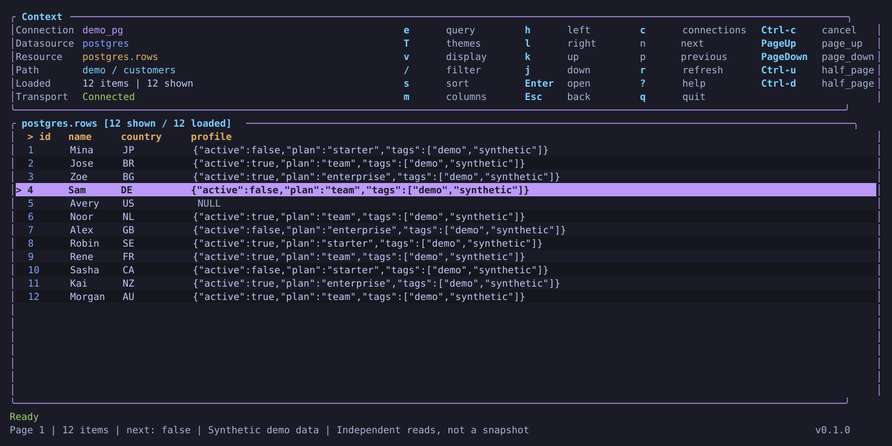
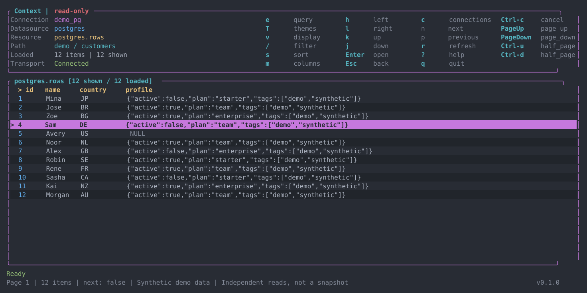
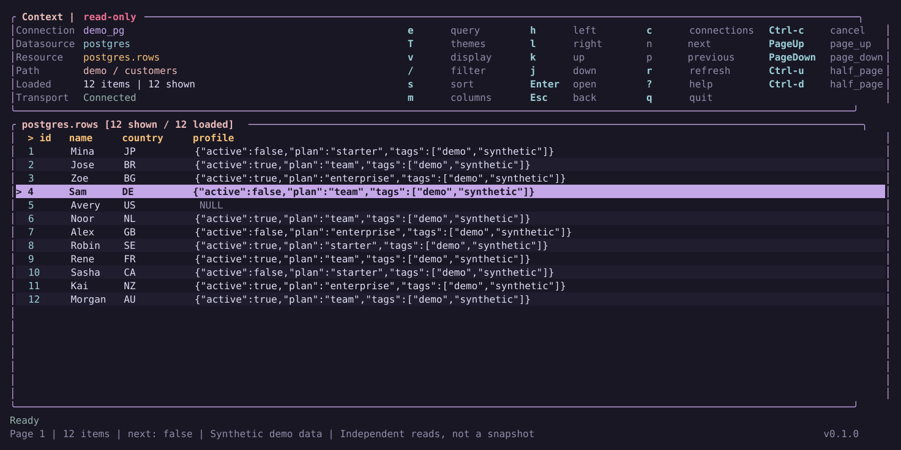
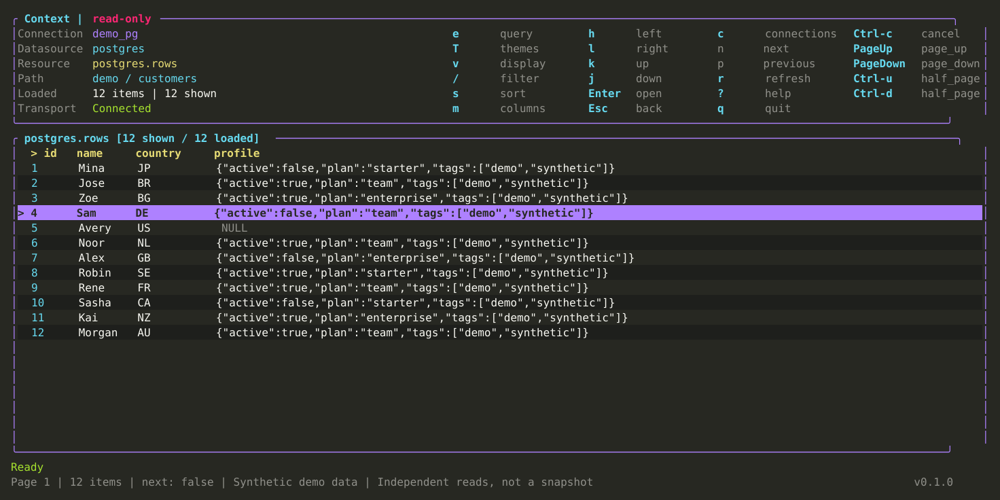
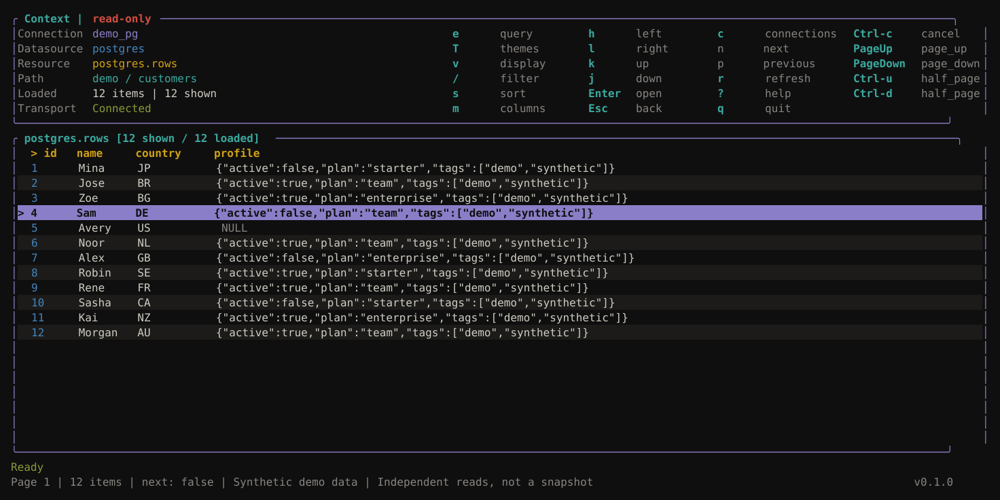

# Themes

Press `T` or enter `:themes`. Use `j`/`k` or the arrow keys to preview, Enter to keep the theme for this session, and Esc to restore the previous theme. The picker does not change your config file.

To set a persistent default, add a top-level setting to your [configuration](../README.md#configuration):

```toml
theme = "monokai"
```

Catppuccin is the default. Use `onetui schema` for the current supported values.

## Gallery

Click an image for its full-size SVG.

| Theme | Theme |
| --- | --- |
| **Catppuccin** (default)<br>`catppuccin`<br>[](assets/themes/catppuccin.svg) | **Gruvbox**<br>`gruvbox`<br>[](assets/themes/gruvbox.svg) |
| **Solarized**<br>`solarized`<br>[](assets/themes/solarized.svg) | **Nord**<br>`nord`<br>[](assets/themes/nord.svg) |
| **Dracula**<br>`dracula`<br>[](assets/themes/dracula.svg) | **Tokyo Night**<br>`tokyo-night`<br>[](assets/themes/tokyo-night.svg) |
| **One Dark**<br>`one-dark`<br>[](assets/themes/one-dark.svg) | **Rosé Pine**<br>`rose-pine`<br>[](assets/themes/rose-pine.svg) |
| **Monokai**<br>`monokai`<br>[](assets/themes/monokai.svg) | **Flexoki**<br>`flexoki`<br>[](assets/themes/flexoki.svg) |
