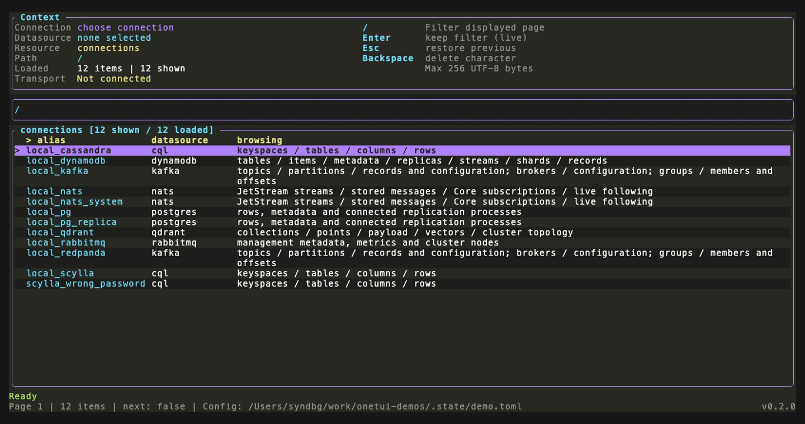

# Themes

Press `T` or enter `:themes`. Use `j`/`k` or the arrow keys to preview, Enter to keep the theme for this session, and Esc to restore the previous theme. The picker does not change your config file.

To set a persistent default, add a top-level setting to your [configuration](../README.md#configuration):

```toml
theme = "monokai"
```

Catppuccin is the default. Use `onetui schema` for the current supported values.

## Gallery

Every built-in theme, previewed live on a PostgreSQL table: Catppuccin (default), Gruvbox, Solarized, Nord, Dracula, Tokyo Night, One Dark, Rosé Pine, Monokai and Flexoki.


